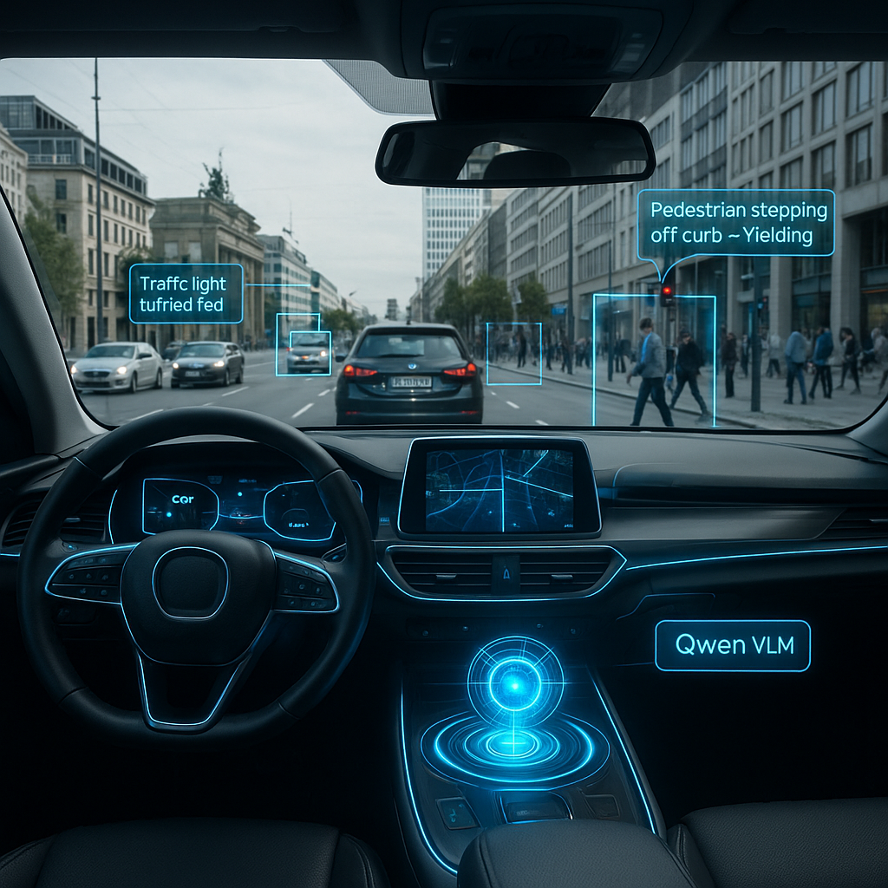

<h1 align="center">Hi 👋, I'm Vishwanath A Sardeshpande</h1>

  

  
  
  
  

---

## 🎓 About Me

As a Master's student specializing in big data and artificial intelligence, I bring a robust software engineering foundation and a data-centric philosophy. My expertise lies in developing real-time ML pipelines, designing edge-ready systems, and leveraging Generative AI to deliver practical, scalable solutions. I possess hands-on experience in production environments, excelling in backend development, data engineering, and cloud technologies.

**Current Focus:**
- 🚂 Graph Neural Networks Research @ Hitachi Rail
- 🚗 Master's Thesis on Autonomous Driving with Vision-Language Models
- 🎓 Graduating March 2026 from SRH Berlin University

---

## 🔬 Master's Thesis

<table>
<tr>
<td width="40%">
  
</td>
<td width="60%">

<h3>Self-Reflective Learning for Autonomous Driving Using Vision-Language Models</h3>

<strong>Timeline:</strong> November 2025 - February 2026 | <strong>Defense:</strong> March 2026

<strong>Three-Phase Learning Framework:</strong>

<ol>
  <li><strong>Supervised Learning</strong> from rule-based teacher → 80% accuracy</li>
  <li><strong>Reinforcement Learning</strong> with GRPO algorithm → +30% improvement</li>
  <li><strong>Self-Reflective Meta-Learning</strong> → +20% additional improvement</li>
</ol>

<strong>Key Achievements:</strong>

<ul>
  <li>Fine-tuned <strong>Qwen3-VL-8B</strong> (8B parameters) on multi-view camera inputs</li>
  <li>Created custom dataset from <strong>CARLA Simulator</strong> using a Rule-based Algorithm</li>
  <li>Developed autonomous failure diagnosis using chain-of-thought reasoning</li>
  <li>Comprehensive evaluation with ablation studies and out-of-distribution testing</li>
</ul>

<strong>Technologies:</strong> PyTorch | MLX | CARLA Simulator | Qwen3-VL | LoRA | GRPO | Explainable AI

</td>
</tr>
</table>

---

## 💼 Professional Experience

### 🚄 Hitachi Rail | Berlin, Germany
**Working Student** | September 2025 - Present

- Conducted comparative analysis of state-of-the-art GNN models (Graph Attention Networks, GCNs)
- Engineered custom Graph Neural Network architectures using PyTorch for graph generation and property prediction
- Leveraged graph-based deep learning to uncover patterns in large-scale interconnected railway data

**Technologies:** PyTorch | PyTorch Geometric | Graph Neural Networks | NetworkX

### 🛋️ Wayfair | Berlin, Germany
**Working Student** | August 2024 - April 2025

- Designed and implemented Vertex AI Pipelines on GCP to automate ML workflows
- Managed job scheduling and debugging DAGs in Apache Airflow
- Developed APM dashboards and system health monitoring in Datadog
- Built monitoring system for Vertex AI Pipelines using Looker Studio

**Technologies:** GCP | Vertex AI | Apache Airflow | Datadog | Looker Studio | Python

### 💼 Kennametal Shared Service Pvt. Ltd. | Bengaluru, India
**SAP ABAP Developer** | May 2022 - March 2024

- Designed Smart Forms, Adobe Forms, and custom reports using ABAP
- Built warehouse management chatbot using AI/LLM, improving efficiency by 18%
- Developed OData application for seamless cross-platform integration

**Technologies:** SAP ABAP | AI/LLM | OData

---

## 🚀 Featured Projects

<table>
<tr>
<td width="50%" valign="top">

### 🤖 Drishti AI
**Generative AI-Powered Assistive Vision Platform**

  
  
  
  

Real-time assistive platform leveraging Generative AI for visual assistance.

#### 🌟 Key Features:
- ✨ Real-time image analysis with **Google Gemini**
- 💬 Natural language query processing
- 🔊 Kokoro text-to-speech for audio feedback
- 📱 React Native mobile client (EXPO)
- 🐳 Dockerized deployment

</td>
<td width="50%" valign="top">

### 💡 Startup Idea Validator
**RAG-Powered Market Sentiment Analysis**

  
  
  
  

RAG system combining Reddit experiences with LLM reasoning for startup validation.

#### 🌟 Key Features:
- 🔍 Market sentiment analysis from Reddit
- 🤖 Retrieval-Augmented Generation system
- 📊 Automated data pipeline
- 🗄️ Vector database for semantic retrieval
- 🌐 LLM fallback with internet search
- 💡 Context-rich startup insights

</td>
</tr>
</table>

---

## 🛠️ Technical Skills

### AI/ML Frameworks & Tools

  
  
  
  
  

  
  
  
  
  
  
  
  

### Programming & Backend

  
  
  
  
  
  

### Frontend

  
  
  
  

### Cloud & DevOps

  
  
  
  
  

### Databases & Storage

  
  
  
  

### Tools

  
  
  
  

---

## 🎯 Currently

- 🔬 Completing Master's Thesis on Autonomous Driving with Vision-Language Models
- 🧠 Research on Graph Neural Networks @ Hitachi Rail
- 🚀 Building production-ready AI/ML systems
- 💼 **Actively seeking full-time AI Engineer / Backend Developer positions in Germany**

---

## 📚 Education

**M.S. Computer Science** - Focus on Big Data and Artificial Intelligence  
SRH Berlin University of Applied Science | April 2024 - March 2026 (Expected)  
📍 Berlin, Germany

**B.E. Information Science and Engineering**  
Sri Krishna Institute of Technology | Graduated August 2022  
📍 Bangalore, Karnataka, India

---

## 📫 Let's Connect!

I'm actively seeking full-time opportunities in AI Engineering and Backend Development in Germany. Open to:

- 🤝 Collaborations on AI/ML projects
- 💼 Full-time job opportunities
- 🔬 Research discussions
- ☕ Networking and knowledge sharing

  
  

---

  <i>⚡ Building the future with AI, one model at a time ⚡</i>

